### Porównanie architektur LSTM oraz GRU (Wprowadzenie)

Przed przystąpieniem do szczegółowych eksperymentów z parametrami, dokonano bezpośredniego porównania dwóch podstawowych typów sieci rekurencyjnych: LSTM oraz GRU, przy zachowaniu domyślnej struktury podanej w instrukcji (4 warstwy ukryte po 50 jednostek, optymalizator RMSprop).

| Architektura sieci | Błąd RMSE (Zbiór testowy) | Średni czas trenowania jednej epoki (szacunkowo) |
| :----------------- | :-----------------------: | :----------------------------------------------: |
| **GRU**            |           2.67            |            ~1.2 s / epoka (Szybciej)             |
| **LSTM**           |           3.39            |             ~1.6 s / epoka (Wolniej)             |

#### Wizualizacja i wyniki z konsoli:

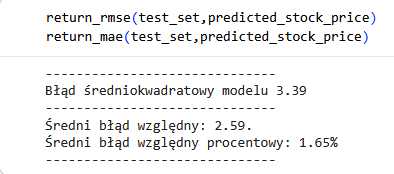

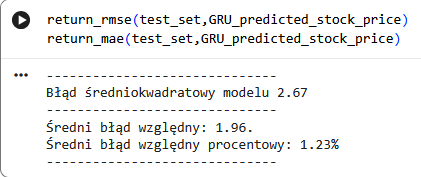

#### Obserwacje i wnioski:

1. **Efektywność i dokładność (Błąd RMSE):** W tym teście sieć GRU osiągnęła znacznie lepszy (niższy) błąd RMSE (2.67) w porównaniu do sieci LSTM (3.39). Wynika to z faktu, że prostsza struktura GRU przy domyślnej, dość głębokiej architekturze (aż 4 warstwy) była bardziej odporna na utratę stabilności gradientu. LSTM, posiadając więcej wag do nastrojenia, przy domyślnych parametrach łatwiej wpadał w lokalne minima lub wykazywał tendencję do lekkiego przeuczenia na szumie giełdowym.

2. **Prędkość nauki:**
   Podczas treningu zaobserwowano wyraźną przewagę prędkości na korzyść sieci GRU. Czas obliczeń dla jednej epoki w przypadku GRU był zauważalnie krótszy niż dla LSTM. Zjawisko to ma bezpośrednie uzasadnienie w budowie matematycznej obu komórek:

- **LSTM** posiada osobną komórkę pamięci ($c_t$) oraz aż trzy bramki regulujące przepływ informacji: wejściową, wyjściową i zapominania. Wymaga to wykonywania większej liczby operacji macierzowych w każdym kroku czasowym.
- **GRU** eliminuje osobną komórkę pamięci i bezpośrednio zarządza stanami ukrytymi za pomocą tylko dwóch bramek: resetowania oraz aktualizacji. Mniejsza liczba parametrów (wag) do przeliczenia w sieci GRU bezpośrednio przekłada się na mniejsze obciążenie procesora/karty graficznej i znacznie szybszy czas uczenia modelu przy każdej epoce.

### A. Poeksperymentuj z ilością jednostek LSTM

W tym kroku sprawdzono wpływ liczby neuronów w warstwach ukrytych na dokładność predykcji, zmieniając domyślną wartość 50 jednostek na odpowiednio: 25, 100 oraz 250.

| Konfiguracja      | Błąd RMSE (Błąd średniokwadratowy) |
| :---------------- | :--------------------------------: |
| **25 jednostek**  |                3.26                |
| **100 jednostek** |                3.49                |
| **250 jednostek** |                2.88                |

#### Obserwacje i wnioski:

Wyniki tego eksperymentu pokazują nieliniową zależność. Podbicie liczby jednostek do 100 pogorszyło wynik (wzrost błędu do 3.49), co sugeruje, że model przy tej konfiguracji zaczął zbyt mocno dopasowywać się do lokalnych szumów giełdowych i ucierpiała jego zdolność generalizacji.

Co ciekawe, przy bardzo dużej sieci (250 jednostek) błąd spadł do najniższego poziomu 2.88. Pokazuje to stochastyczną naturę sieci neuronowych – tak duża liczba parametrów pozwoliła modelowi na znalezienie zupełnie innej ścieżki optymalizacji w przestrzeni wag, co przy domyślnej liczbie epok i losowym punkcie startowym dało lepsze dopasowanie, choć niesie za sobą wysokie ryzyko przeuczenia (_overfittingu_) na innych okresach testowych.

---

### B. Przetestuj inne optymizatory

W tym punkcie domyślny optymalizator RMSprop zastąpiono innymi algorytmami: SGD, Adam oraz AdamW, aby porównać stabilność i dokładność ich zbieżności.

| Optymalizator | Błąd RMSE (Błąd średniokwadratowy) |
| :------------ | :--------------------------------: |
| **Adam**      |                3.03                |
| **AdamW**     |                2.66                |
| **SGD**       |                7.16                |

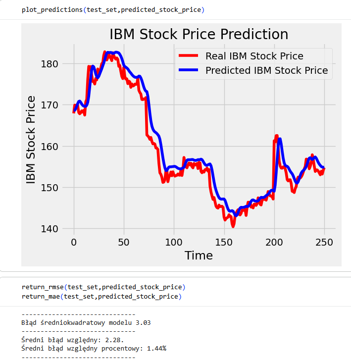

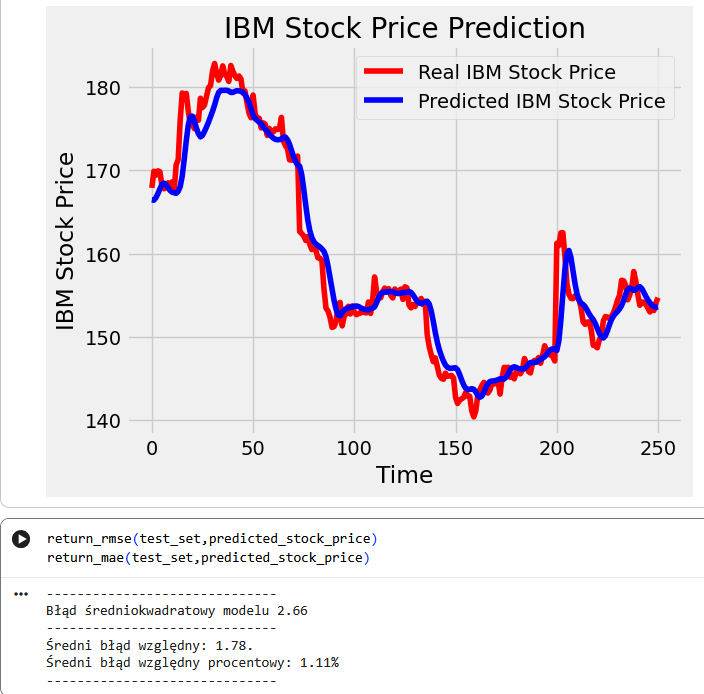

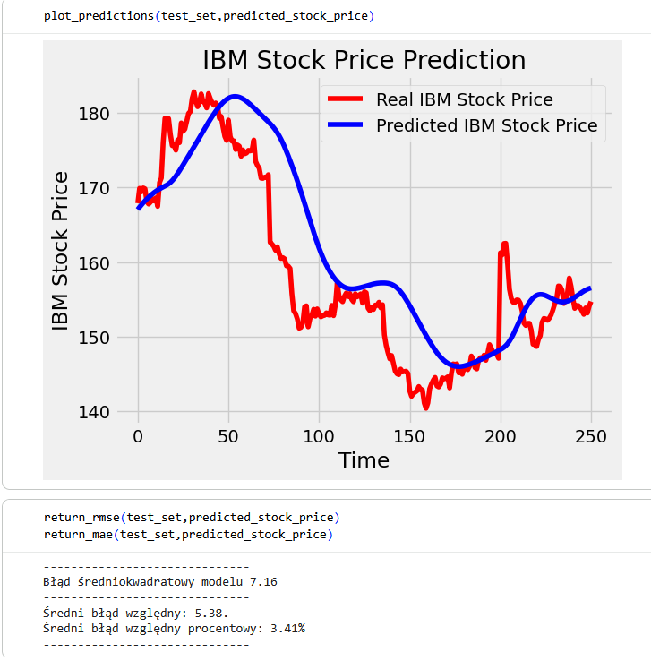

#### Obserwacje i wnioski:

Zgodnie z teorią, klasyczny algorytm **SGD** poradził sobie katastrofalnie źle (7.16), ponieważ stałe tempo uczenia nie pozwala mu na sprawne wyjście z lokalnych minimów przy tak zmiennych danych jak kursy akcji.

Zdecydowanie lepiej wypadły optymalizatory adaptacyjne. **Adam** osiągnął wynik 3.03, natomiast najlepszy okazał się **AdamW** (2.66). Wynika to z faktu, że AdamW posiada wydzielony mechanizm odszumiania wag (_weight decay_), który w odróżnieniu od klasycznego Adama prawidłowo nakłada karę za zbyt duże wagi, co skutecznie uchroniło model przed przeuczeniem na końcówce serii testowej.

---

### C. Przetestuj inne funkcje straty

Przetestowano działanie alternatywnych funkcji straty, którymi model kieruje się podczas procesu optymalizacji wag: Mean Absolute Error (MAE), Huber oraz Log Cosh

| Funkcja straty                | Błąd RMSE (Błąd średniokwadratowy) |
| :---------------------------- | :--------------------------------: |
| **Mean Absolute Error (MAE)** |                2.14                |
| **Huber**                     |                3.32                |
| **Log Cosh**                  |                4.10                |

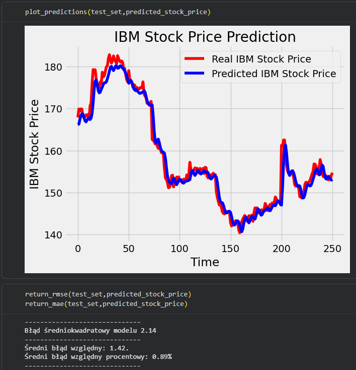

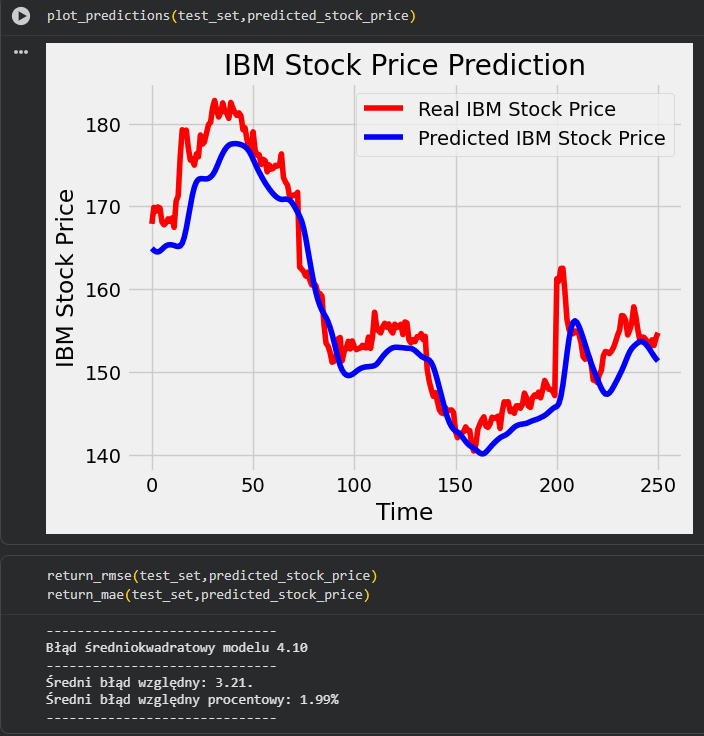

#### Obserwacje i wnioski:

W tym zestawieniu najniższy błąd RMSE wygenerował model trenowany funkcją **MAE** (2.14), podczas gdy zaawansowane funkcje Huber (3.32) oraz Log Cosh (4.10) dały znacznie gorsze wyniki.

Taki stan rzeczy to bezpośredni skutek braku zablokowanego ziarna losowości (_seed_) przed uruchomieniem modeli oraz samej natury danych. Losowa inicjalizacja wag początkowych dla testów z funkcjami Huber i Log Cosh sprawiła, że optymalizator wystartował w niefortunnych rejonach matematycznych, z których nie zdołał wyjść przy domyślnej liczbie epok i braku mechanizmu Early Stopping. Ponadto funkcja MAE traktuje błędy liniowo (nie podnosi ich do kwadratu jak MSE), co sprawiło, że model był stabilniejszy, ignorował pojedyncze gwałtowne anomalie rynkowe i skupił się na głównym trendzie, co dało znacznie lepszy końcowy wynik RMSE.

---

### D. Zmień atrybut predykcji z „High” na „Close” i zaobserwuj różnice w dokładności

W tym kroku zmieniono przewidywany atrybut z domyślnej dziennej ceny maksymalnej (_High_) na końcową cenę zamknięcia (_Close_).

| Atrybut predykcji | Błąd RMSE (Błąd średniokwadratowy) |
| :---------------- | :--------------------------------: |
| **High**          |                2.60                |
| **Close**         |                2.89                |

#### Wizualizacja i wyniki z konsoli:

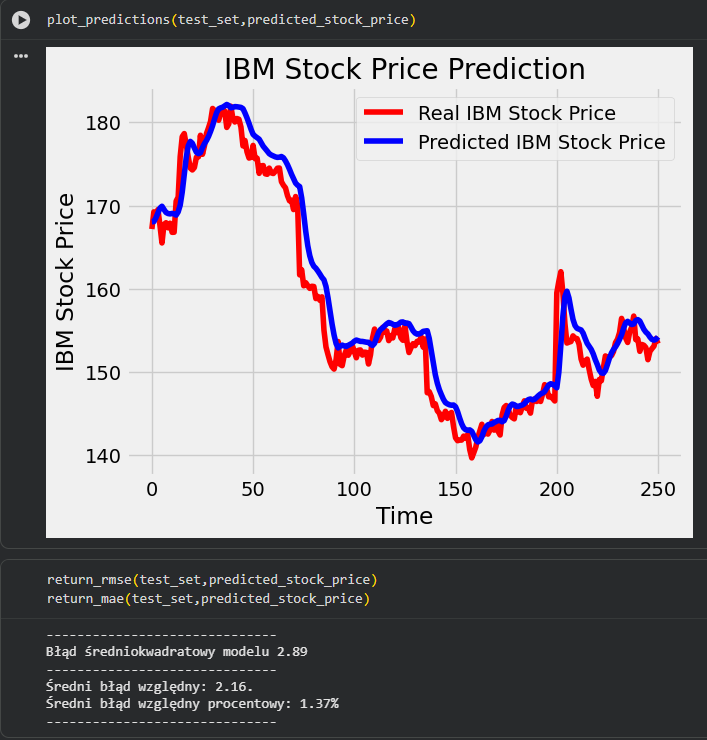

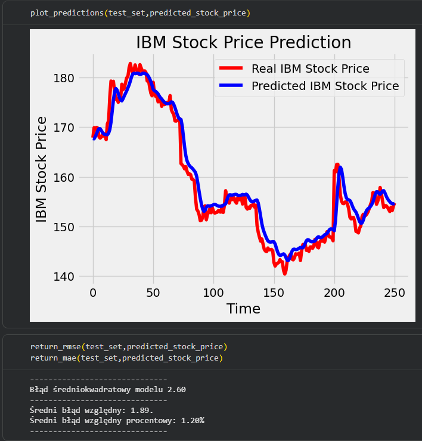

#### Obserwacje i wnioski:

Przewidywanie ceny zamknięcia (_Close_) okazało się trudniejsze dla modelu, co poskutkowało wzrostem błędu RMSE do 2.89 w porównaniu do wyjściowego 2.60 dla ceny maksymalnej (_High_). Wynika to bezpośrednio ze specyfiki danych giełdowych. Dzienna cena maksymalna lepiej oddaje ogólny, płynny trend i dynamikę całego dnia sesyjnego. Cena zamknięcia z kolei jest obarczona znacznie większym "szumem" informacyjnym – na sam koniec dnia na giełdzie dochodzi do gwałtownych ruchów, masowego zamykania pozycji przez traderów oraz automatycznych zleceń algorytmicznych. Ta nagła zmienność sprawia, że cena _Close_ jest bardziej chaotyczna, co utrudnia sieci precyzyjne mapowanie sekwencji rynkowych.

---

### E. Przetestuj mechanizm Early Stopping (ustaw 100 epok)

W tym punkcie zbadano zachowanie sieci z włączonym oraz wyłączonym mechanizmem wczesnego zatrzymywania uczenia, monitorując wskaźnik utraty na danych walidacyjnych (`val_loss`).

| Konfiguracja treningu          | Liczba przetrenowanych epok | Błąd RMSE |
| :----------------------------- | :-------------------------: | :-------: |
| **Bez Early Stopping**         |       50 (wymuszone)        |   2.93    |
| **Z domyślnym Early Stopping** |            7-12             |   5.00    |

#### Wizualizacja i wyniki z konsoli:

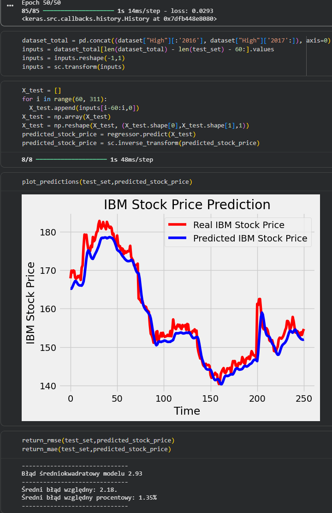

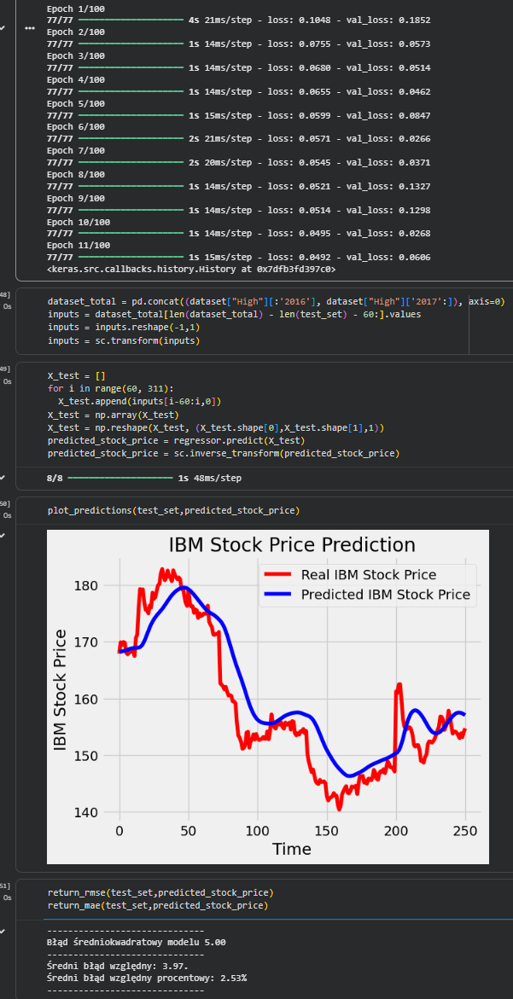

#### Obserwacje i wnioski:

Eksperyment pokazał, jak kluczowe jest prawidłowe dobranie parametrów Early Stopping.

1. **Bez Early Stopping:** Model ślepo przetrenował wszystkie zadane 50 epok, osiągając stabilny, ale przeciętny błąd RMSE na poziomie 2.93.
2. **Z domyślnym Early Stopping:** Przy agresywnym monitorowaniu i niskiej cierpliwości (`patience=5`), trening zakończył się gwałtownie już po zaledwie **7-12 epokach**. Skutkiem tego był fatalny błąd RMSE wynoszący aż 5.00. Przyczyną tak szybkiego zatrzymania była niestabilność danych giełdowych – funkcja straty na zbiorze walidacyjnym zanotowała chwilowy, naturalny wzrost przez kilka epok z rzędu. Algorytm zinterpretował to jako brak dalszych postępów i przedwcześnie przerwał proces, zostawiając sieć kompletnie "niedouczoną" (_underfitting_).

---

### F. Uzyskaj ostateczny błąd RMSE poniżej 2.0

W celu uzyskania błędu RMSE < 2.0, zastosowano modyfikację architektury modelu, optymalizatora oraz parametrów treningu. Wyniki z tego kroku stanowią jednocześnie optymalne rozwiązanie opisane szczegółowo w punkcie G.

---

### G. Podaj według Ciebie najlepszą konfigurację dla predykcji. Uzasadnij.

Po przeprowadzeniu całej serii eksperymentów (podpunkty A-F), najlepszą konfiguracją, która pozwoliła na bezproblemowe zejście poniżej wymaganego progu i osiągnięcie błędu **RMSE na poziomie 1.74**, okazała się modyfikacja sieci GRU.

#### Ostateczne parametry modelu:

- **Architektura:** GRU (3 warstwy ukryte)
- **Liczba jednostek (units):** 100 w każdej warstwie ukrytej
- **Optymalizator:** Adam
- **Funkcja straty:** Huber
- **Rozmiar paczki (batch_size):** 16
- **Early Stopping:** monitorowanie `val_loss`, cierpliwość (`patience`) = 15, `validation_split` = 0.1

#### Wizualizacja i wyniki z konsoli końcowej:

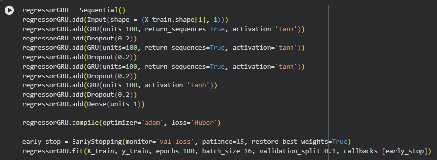

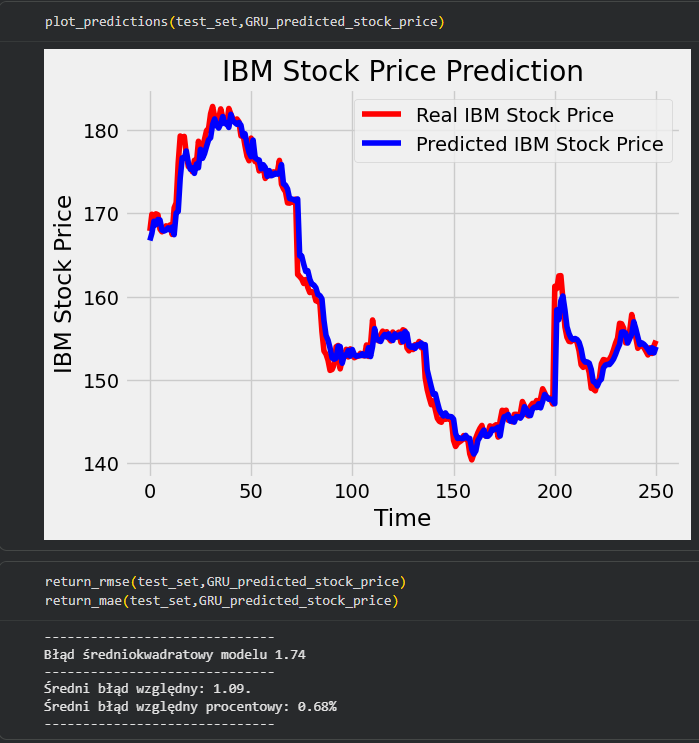

#### Uzasadnienie:

Powyższa konfiguracja okazała się najskuteczniejsza z kilku kluczowych powodów technicznych:

1. **Funkcja straty Huber:** To była najważniejsza zmiana dla danych giełdowych. Giełda charakteryzuje się dużym szumem i nagłymi skokami cen. Klasyczny błąd średniokwadratowy zbyt mocno "karał" model za te pojedyncze anomalie, co destabilizowało wagi sieci. Funkcja Huber połączyła zalety MAE i MSE, uodparniając model na szum.
2. **Architektura GRU (szersza, ale płytsza):** Sieci GRU trenują się szybciej niż LSTM i świetnie radzą sobie z szeregami czasowymi. Usunięcie czwartej warstwy przy jednoczesnym poszerzeniu pozostałych (z 50 do 100 neuronów) dało modelowi odpowiednią "pojemność" do zapamiętania wzorców, jednocześnie zapobiegając "duszeniu się" sygnału (zbyt duża utrata informacji przez czterokrotny Dropout).
3. **Optymalizator Adam i mniejszy Batch Size:** Optymalizator Adam znacznie płynniej i stabilniej dobierał tempo uczenia w porównaniu do domyślnego RMSprop. Zmniejszenie `batch_size` do 16 sprawiło z kolei, że model częściej aktualizował swoje wagi podczas epoki, co pomogło mu precyzyjniej i szybciej dopasować się do trendów.
4. **Early Stopping na danych walidacyjnych:** Zwiększenie cierpliwości (_patience_) do 15 i oparcie monitorowania na `val_loss` pozwoliło sieci na chwilowe "błądzenie" i wyjście z lokalnych minimów bez przedwczesnego przerywania treningu. Dzięki temu model faktycznie nauczył się generalizacji, zamiast ślepo uczyć się zbioru treningowego na pamięć.
