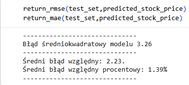
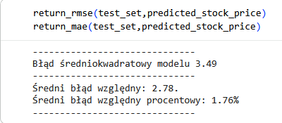
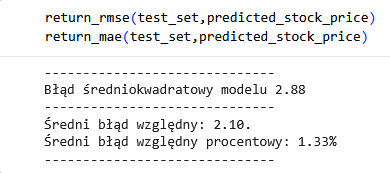

### A. Poeksperymentuj z ilością jednostek LSTM

W tym kroku sprawdzono wpływ liczby neuronów w warstwach ukrytych na dokładność predykcji, zmieniając domyślną wartość 50 jednostek na odpowiednio: 25, 100 oraz 250.

| Konfiguracja      | Błąd RMSE (Błąd średniokwadratowy) |
| :---------------- | :--------------------------------: |
| **25 jednostek**  |                3.26                |
| **100 jednostek** |                3.49                |
| **250 jednostek** |                2.88                |

#### Obserwacje i wnioski:

Wyniki tego eksperymentu pokazują nieliniową zależność. Podbicie liczby jednostek do 100 pogorszyło wynik (wzrost błędu do 3.49), co sugeruje, że model przy tej konfiguracji zaczął zbyt mocno dopasowywać się do lokalnych szumów giełdowych i ucierpiała jego zdolność generalizacji.

Co ciekawe, przy bardzo dużej sieci (250 jednostek) błąd spadł do najniższego poziomu 2.88. Pokazuje to stochastyczną naturę sieci neuronowych – tak duża liczba parametrów pozwoliła modelowi na znalezienie zupełnie innej ścieżki optymalizacji w przestrzeni wag, co przy domyślnej liczbie epok i losowym punkcie startowym dało lepsze dopasowanie, choć niesie za sobą wysokie ryzyko przeuczenia (_overfittingu_) na innych okresach testowych.

---

### B. Przetestuj inne optymizatory

W tym punkcie domyślny optymalizator RMSprop zastąpiono innymi algorytmami: SGD, Adam oraz AdamW, aby porównać stabilność i dokładność ich zbieżności.

| Optymalizator | Błąd RMSE (Błąd średniokwadratowy) |
| :------------ | :--------------------------------: |
| **Adam**      |                3.03                |
| **AdamW**     |                2.66                |
| **SGD**       |                7.16                |

#### Obserwacje i wnioski:

Zgodnie z teorią, klasyczny algorytm **SGD** poradził sobie katastrofalnie źle (7.16), ponieważ stałe tempo uczenia nie pozwala mu na sprawne wyjście z lokalnych minimów przy tak zmiennych danych jak kursy akcji.

Zdecydowanie lepiej wypadły optymalizatory adaptacyjne. **Adam** osiągnął wynik 3.03, natomiast najlepszy okazał się **AdamW** (2.66). Wynika to z faktu, że AdamW posiada wydzielony mechanizm odszumiania wag (_weight decay_), który w odróżnieniu od klasycznego Adama prawidłowo nakłada karę za zbyt duże wagi, co skutecznie uchroniło model przed przeuczeniem na końcówce serii testowej.

---

### C. Przetestuj inne funkcje straty

Przetestowano działanie alternatywnych funkcji straty, którymi model kieruje się podczas procesu optymalizacji wag: Mean Absolute Error (MAE), Huber oraz Log Cosh

| Funkcja straty                | Błąd RMSE (Błąd średniokwadratowy) |
| :---------------------------- | :--------------------------------: |
| **Mean Absolute Error (MAE)** |                2.14                |
| **Huber**                     |                3.32                |
| **Log Cosh**                  |                4.10                |

#### Obserwacje i wnioski:

W tym zestawieniu najniższy błąd RMSE wygenerował model trenowany funkcją **MAE** (2.14), podczas gdy zaawansowane funkcje Huber (3.32) oraz Log Cosh (4.10) dały znacznie gorsze wyniki.

Taki stan rzeczy to bezpośredni skutek braku zablokowanego ziarna losowości (_seed_) przed uruchomieniem modeli oraz samej natury danych. Losowa inicjalizacja wag początkowych dla testów z funkcjami Huber i Log Cosh sprawiła, że optymalizator wystartował w niefortunnych rejonach matematycznych, z których nie zdołał wyjść przy domyślnej liczbie epok i braku mechanizmu Early Stopping. Ponadto funkcja MAE traktuje błędy liniowo (nie podnosi ich do kwadratu jak MSE), co sprawiło, że model był stabilniejszy, ignorował pojedyncze gwałtowne anomalie rynkowe i skupił się na głównym trendzie, co dało znacznie lepszy końcowy wynik RMSE.
